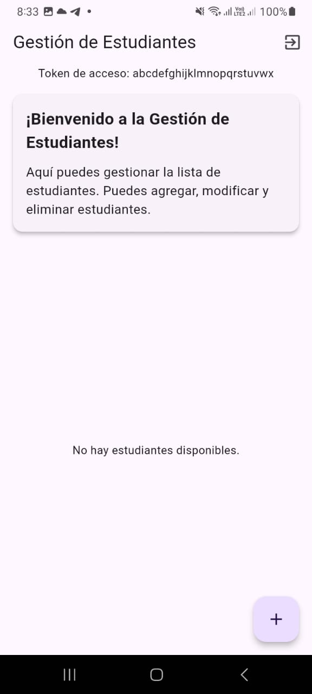
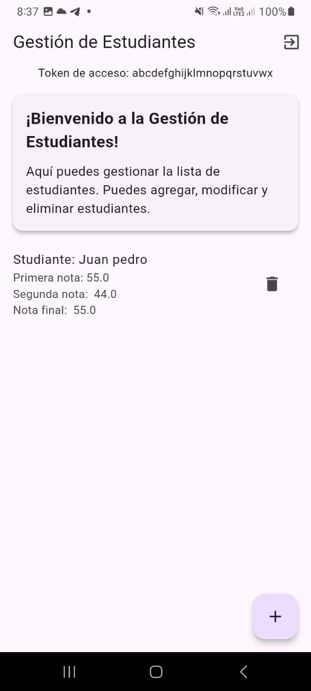
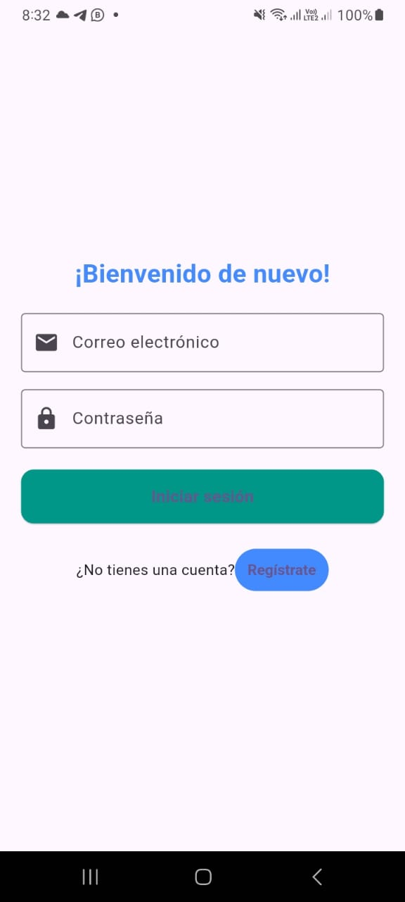
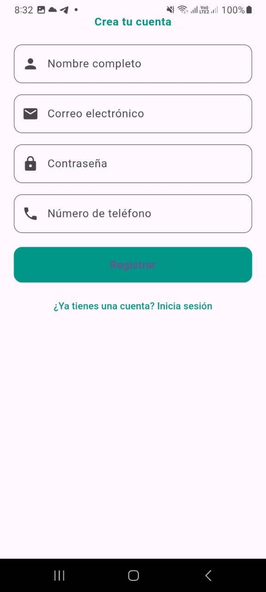

# notasbex

## Pasos para ejecutar el proyecto

1. Clonar el repositorio
2. Despues de clonado el repositorio ejeccutar el comanto `flutter pub get`
3. Ejecutar `flutter run`

## Apk solicitada

La apk solicitada se encuenta en la siguiente rita:

```
notasbex/apk/app-release.apk
```

## Capturas de pantalla





